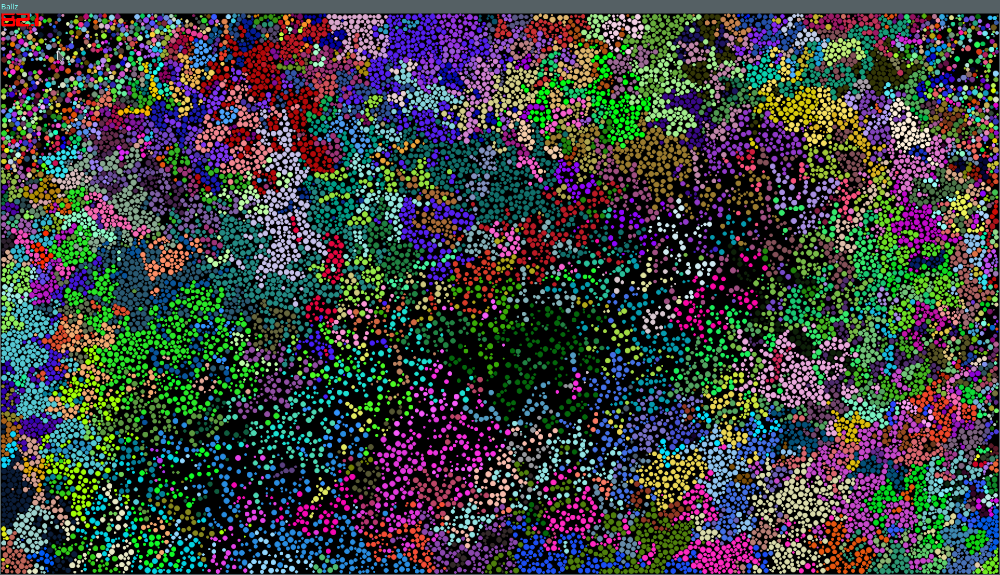
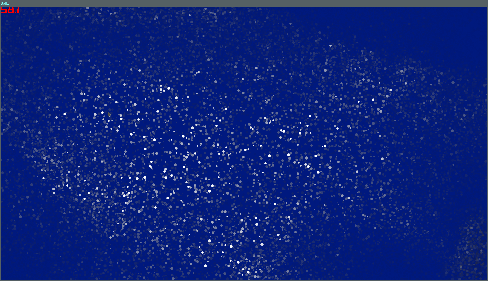
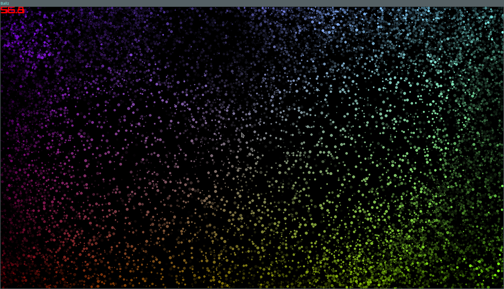

# Ballz

A physics simulation with hot-swappable renderers and spatial partitioning

Click and drag a ball on screen to create collisions.
Press `1` to switch to different renderers on the fly.

## Default rendering:

## Momentum based rendering:

## Horizontal velocity rendering:

